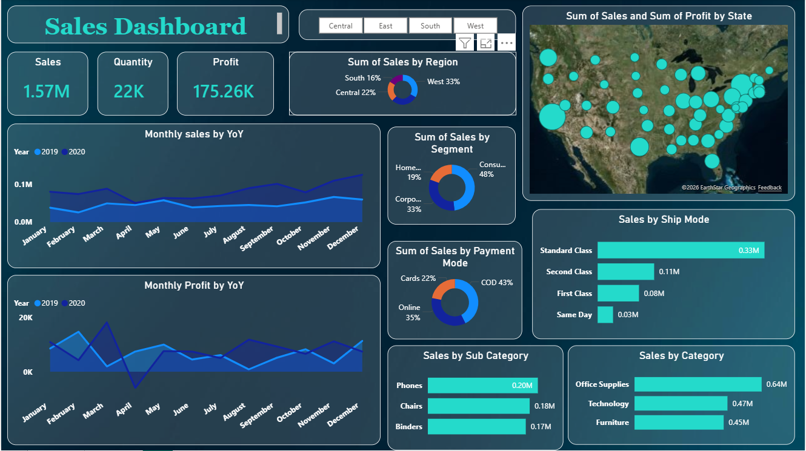
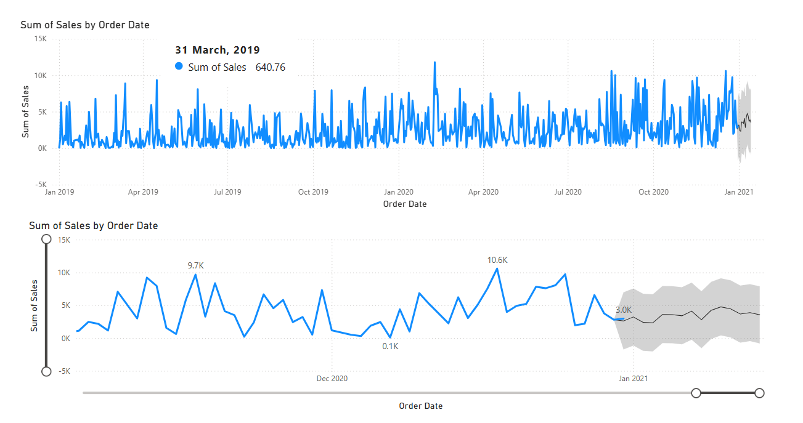

# 📊 Sales Forecasting & Trend Analysis Dashboard

## 📌 Overview

This project focuses on **sales trend analysis and time-series forecasting** using historical sales data to uncover patterns, seasonality, and future demand trends.  

An interactive **Power BI dashboard** is built to analyze sales performance across time, regions, segments, categories, and shipping modes, along with **forecasted sales projections** to support business decision-making.

The project demonstrates strong skills in **data modeling, analytics, forecasting, and dashboard design**, commonly required for **Data Analyst / Analytics Engineer / BI roles**.

---

## 🏗️ Dashboard Objectives

- Analyze **historical sales trends**
- Identify **seasonality & YoY growth**
- Compare **regional & category performance**
- Forecast **future sales demand**
- Enable **business-driven insights** through interactivity

---

## 🧰 Tech Stack

- **Visualization Tool:** Power BI  
- **Data Modeling:** Star Schema  
- **Analytics:** Time-Series Analysis  
- **Forecasting:** Power BI built-in forecasting  
- **Data Source:** Processed Gold-layer tables (fact & dimensions)  
- **Version Control:** GitHub  

---

## 📈 Key Dashboards & Insights

### 🔹 Sales Trend Analysis (Time Series)

**What the dashboard shows:**
- Daily sales trend from **2019 to 2021**
- High volatility with recurring sales spikes
- Clear **seasonal demand patterns**
- End-of-year sales growth trend

**Insights:**
- Sales show **strong fluctuations**, indicating promotional or seasonal events
- Peaks around **Q4 (Oct–Dec)** suggest festive or year-end demand
- Periodic drops indicate low-demand cycles

---

### 🔹 Sales Forecasting

**What the forecast shows:**
- Future sales projections based on historical trends
- Confidence bands indicating forecast uncertainty
- Continuation of seasonal patterns into the forecast horizon

**Insights:**
- Forecast predicts **stable to moderately increasing sales**
- Seasonal spikes are expected to continue
- Helps businesses plan **inventory, logistics, and marketing spend**

---

### 🔹 KPI Overview

| Metric | Value |
|------|------|
| **Total Sales** | 1.57M |
| **Total Quantity Sold** | 22K |
| **Total Profit** | 175.26K |

**Insights:**
- Strong revenue generation with healthy profitability
- High sales volume indicates scalable operations

---

### 🔹 Regional Sales Distribution

- **West:** 33% (Highest contributor)
- **Central:** 22%
- **South:** 16%
- **East:** Remaining share

**Insights:**
- West region is the **primary revenue driver**
- Central region shows growth potential
- Helps prioritize **regional strategies**

---

### 🔹 Segment Analysis

| Segment | Contribution |
|-------|-------------|
| Consumer | 48% |
| Corporate | 33% |
| Home Office | 19% |

**Insights:**
- Consumer segment dominates sales
- Corporate sales are strong and stable
- Opportunities to grow Home Office segment

---

### 🔹 Category & Sub-Category Analysis

**Top Categories by Sales:**
- Office Supplies – 0.64M
- Technology – 0.47M
- Furniture – 0.45M

**Top Sub-Categories:**
- Phones
- Chairs
- Binders

**Insights:**
- Office Supplies generate the highest revenue
- Technology shows high value per order
- Useful for **product prioritization**

---

### 🔹 Shipping Mode Performance

| Ship Mode | Sales |
|---------|------|
| Standard Class | 0.33M |
| Second Class | 0.11M |
| First Class | 0.08M |
| Same Day | 0.03M |

**Insights:**
- Standard shipping is most cost-effective and preferred
- Same-day delivery has lower adoption, possibly due to cost

---

## 🧠 Business Value

This dashboard enables stakeholders to:

- Predict future sales demand
- Identify high-performing regions and products
- Optimize inventory & supply chain planning
- Improve pricing and promotion strategies
- Support data-driven decision-making

---

## 📂 Project Structure

